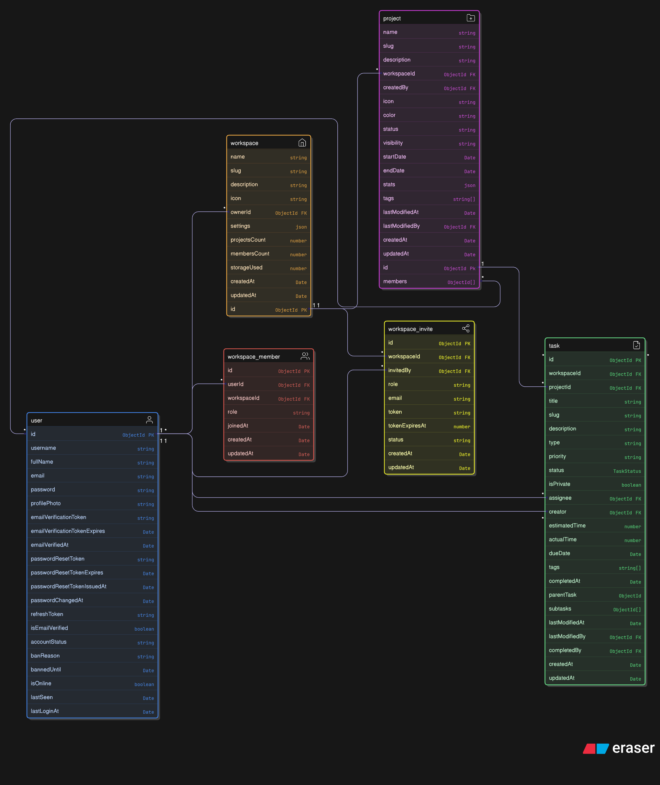

# Database Schema

## Entity Relationship Diagram

## Collections

### users

- App-level identity
- Stores hashed refresh tokens
- No workspace data here

### workspaces

- `ownerId`: User reference
- Isolated containers

### workspace_members

- Junction table: userId + workspaceId + role
- Roles: owner, admin, member
- **Why separate collection?** User can belong to multiple workspaces

### projects

- `workspaceId`: Scoping (required)
- `creatorId`: Ownership tracking
- `visibility`: public/private
- **Index**: (workspaceId, creatorId) for access checks

### Referenced vs Embedded

- Members are referenced (not embedded in workspace)
  - Why? Users can belong to multiple workspaces
  - Avoids duplication

### Workspace Scoping

- Every non-user collection has workspaceId
- Enforces isolation at DB level
- Prevents accidental cross-workspace queries
